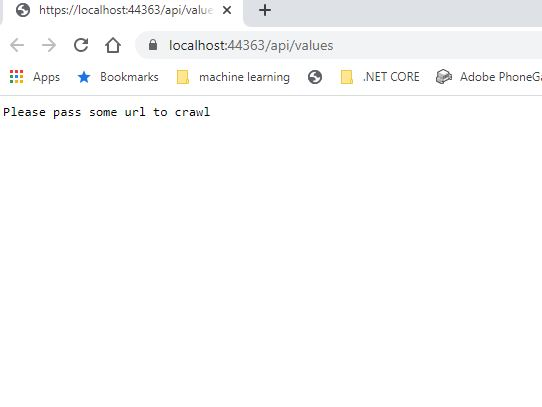
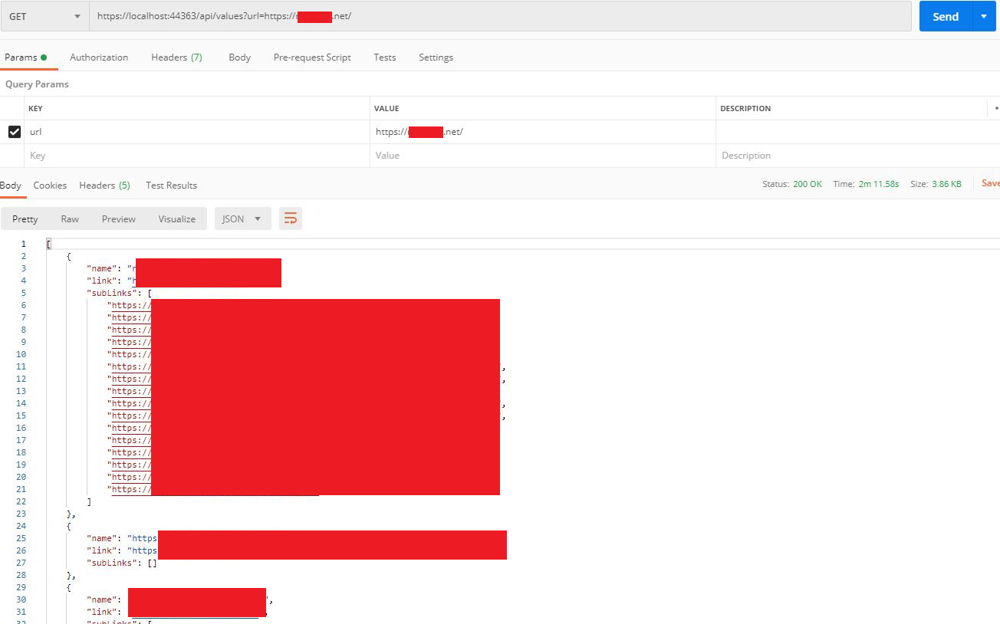
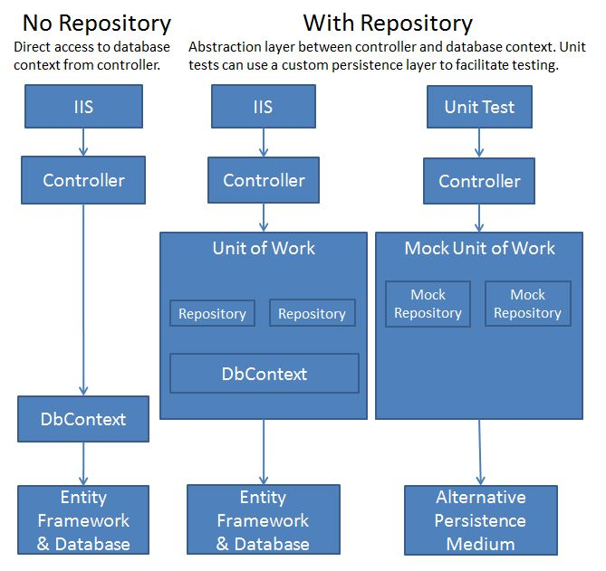

# Crawler (.NetCore - RestAPI)

A simple crawler Api written in .Net Core. It will start crawling from the root url and then traverse on the whole tree of pages to get 
the unique urls with in that domain and store the pages content into the files. 
Urls are also stored within a json file.

## Getting Started

Clone the repository and run the project through visual studio otherwise you can all use command line with the project directory with
the following command.

```
dotnet run
```

Now you will get the following output on the browser, if your browser is allowed to start.



Now you can call the api from the postman by passing a url parameters as follow. 



### Response

In the response you will get different url with the child urls, but all child urls are unique. The url which are already a child of some
other url will be skipped because we donot want to crawl same url again and again. 

### Packages which are used in the crawler are as follow

1. [HtmlAgilityPack](https://html-agility-pack.net/) 
1. [RobotsTxt](https://bitbucket.org/cagdas/robotstxt/src)

### Repository Pattern
Although this was a small project, still i have tried to do this through Repository Pattern approch. Normally Repositoy Pattern is used
to add an abstraction layer between the Database and Business Logic. Here we donot have any database involved, so i put all the logic in
repository and keep the controller clean. 



But if you want to understand more about the repository pattern, please follow this [link](https://docs.microsoft.com/en-us/aspnet/mvc/overview/older-versions/getting-started-with-ef-5-using-mvc-4/implementing-the-repository-and-unit-of-work-patterns-in-an-asp-net-mvc-application).
